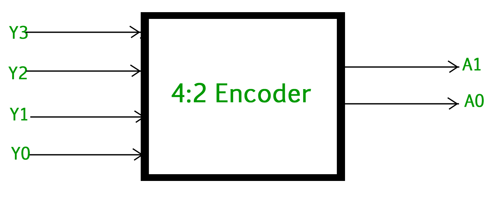
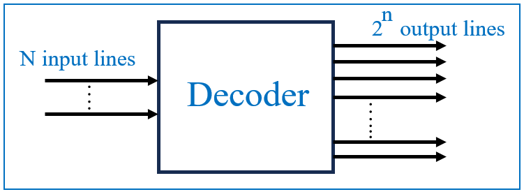
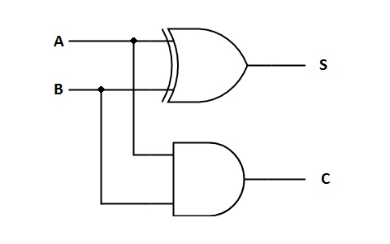
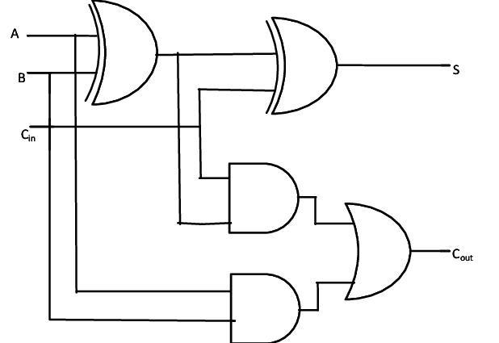
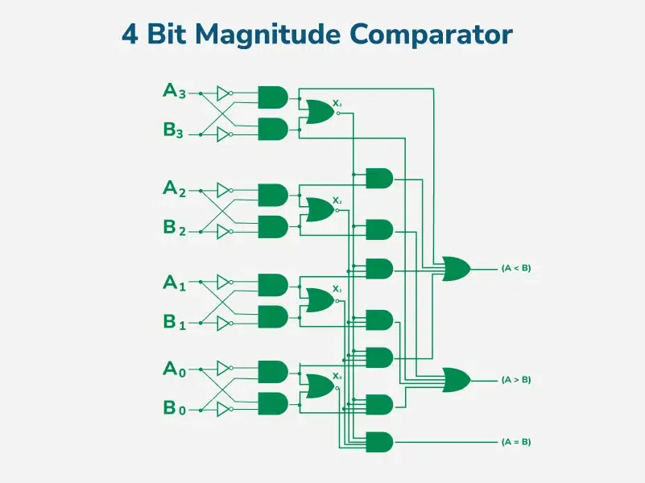
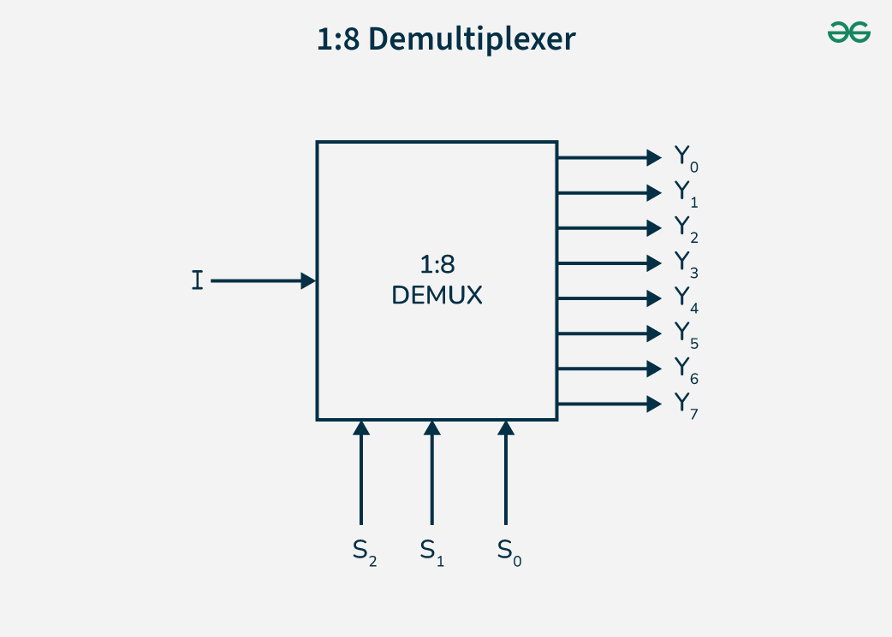
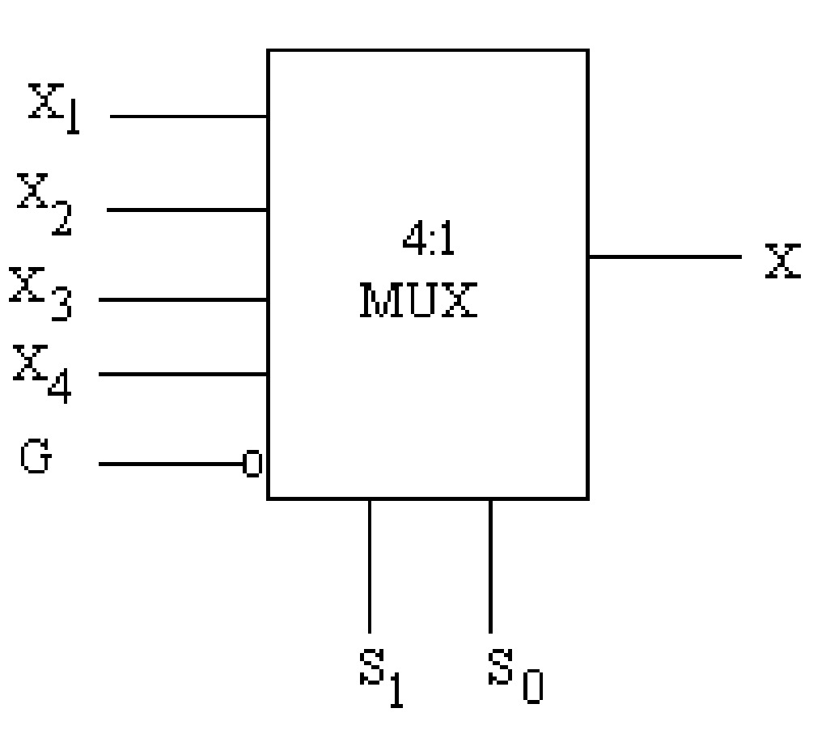

## Table of Contents
1. [Encoder](#encoder)
2. [Decoder](#decoder)
3. [Adders](#adders)
- [Half Adder](#half-adder)
- [Full Adder](#full-adder)
4. [Comparator](#comparator)
5. [Demux](#demux)
6. [Mux](#mux)

---

## Encoder

An **encoder** is a combinational circuit that converts multiple input signals into a coded binary output. It typically has "2^n" input lines and *"n"* output lines.

### How it works

Encoders work by detecting which input is active and generating a corresponding binary code. For example, in a 4-to-2 encoder, if input 3 (binary "11") is active, the output will be "11".

### Diagram

---

## Decoder

A **decoder** is a combinational circuit that converts binary-coded inputs into a one-hot output, meaning only one output is active at a time.

### How it works

A typical n-to-2^n decoder takes "n" binary inputs and activates one of "2^n" outputs. This is useful in memory addressing and demultiplexing.

### Diagram

---

## Adders

Adders are fundamental circuits used to perform binary addition.

### Half Adder

A **half adder** adds two single-bit binary numbers and outputs a sum and carry.

### How it works

- Sum = A XOR B
- Carry = A AND B

### Diagram

### Full Adder

A **full adder** adds three input bits: two significant bits and a carry bit from the previous addition.

### How it works

- Sum = A XOR B XOR Cin
- Carry = (A AND B) OR (Cin AND (A XOR B))

### Diagram

---

## Comparator

A **comparator** compares two binary values and determines their relationship (equal, greater than, or less than).

### How it works

A "n-bit" comparator has two inputs (A, B) and three outputs:

- A > B
- A < B
- A = B

### Diagram

---

## Demux

A **demultiplexer (DEMUX)** takes a single input and routes it to one of several output lines based on a selector input.

### How it works

A 1-to-4 DEMUX has one data input, two selector inputs, and four outputs. The active output is determined by the selector inputs.

### Diagram

---

## Mux

A **multiplexer (MUX)** selects one of several input signals and forwards it to a single output.

### How it works

A 4-to-1 MUX has four inputs, two selector lines, and one output. The selector lines choose which input is transmitted to the output.

### Diagram

---

