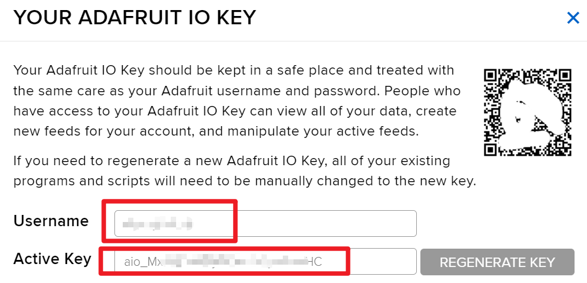
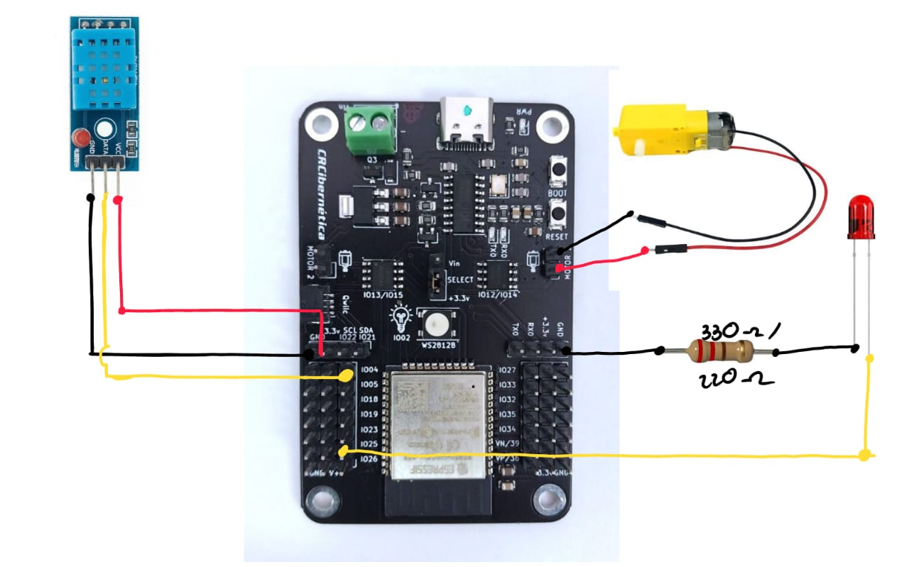
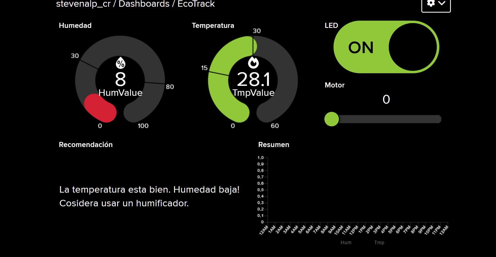

# Manual de Instalación y Uso de EcoTrack

## Componentes para el montaje

- ESP32 (Ideaboard)
- Sensor DHT11
- Motor DC
- Jumpers
- Diodo LED
- Resistencia de 330 Ohmios

## Software requerido

1. Visita [**Adafruit IO**](https://io.adafruit.com) y haz clic en **Get Started for Free** para crear una cuenta.
2. Una vez registrada la cuenta, inicia sesión y abre Adafruit IO.
3. Accede a **Dashboard** y selecciona **New Dashboard**.
4. Ingresa al nuevo **Dashboard** y crea los siguientes bloques:
   - **Toggle** con feed llamado **Act** (valores por defecto).
   - **Slider** con feed llamado **Motor** (Slider Max Value: 2, Slider Step Size: 1).
   - **Gauge** con feed llamado **Hum** (valores por defecto).
   - **Gauge** con feed llamado **Tmp** (valores por defecto).
   - **Multi-line text block** con feed llamado **Rmc**.
   - **Line chart** con los feeds **Hum** y **Tmp**, con historial de **24 horas**.
5. Selecciona **Edit Layout** para acomodar los elementos a tu gusto.

## Guía de Programación

Puedes descargar el código fuente desde el siguiente enlace:
[Descargar código](https://drive.google.com/file/d/1-eV4g_7RTkI8E7Vyi7OwtcP-vnLfZ3h4/view?usp=sharing)

### Clave API de Adafruit IO
1. Haz clic en el icono de llave/candado amarillo ubicado en la parte superior derecha de la página del dashboard.
2. Se mostrarán tu nombre de usuario y tu CLAVE API.
3. Cópialos y guárdalos, ya que los necesitarás más adelante para configurar tu código.


### Configuración de la conexión WiFi

1. Abre el código y busca la sección de configuración de WiFi.
2. Reemplaza "SSID" y "PASSWORD" con los datos de tu red.

```cpp
#define WLAN_SSID "TU_SSID"
#define WLAN_PASS "TU_PASSWORD"
```

3. Luego, reemplaza "YOUR_ADAFRUIT_IO_USERNAME" y "YOUR_ADAFRUIT_IO_KEY" con tus credenciales de Adafruit IO.

```cpp
#define AIO_USERNAME "TU_USUARIO"
#define AIO_KEY "TU_CLAVE_API"
```

4. Descarga e instala las siguientes librerías:
   - **Adafruit MQTT**
   - **[DHT Library](https://drive.google.com/file/d/1O7gsOgOGoDUxtlR6xFqhlw0__9JAbKO_/view?usp=sharing)**

5. Carga y ejecuta el programa en el ESP32.

## Diagrama eléctrico de montaje

Sigue las conexiones indicadas en el siguiente diagrama:


## Guía General

### Humedad y Temperatura

- La humedad ideal para las plantas varía entre **40% y 60%**.
- Un valor inferior al **30%** indica un ambiente seco, mientras que valores superiores al **80%** pueden favorecer la aparición de hongos.
- La temperatura se considera alta si supera los **30°C**, y baja si es menor a **10°C**.

### Control del LED
- **Estado ON:** Encender el LED.
- **Estado OFF:** Apagar el LED.

### Control del Motor

- **Estado 0:** Apagado.
- **Estado 1:** Gira en sentido horario.
- **Estado 2:** Gira en sentido antihorario.

## Visualización de Datos y Recomendaciones

El sistema muestra un gráfico con la evolución de **temperatura** (naranja) y **humedad** (verde) en las últimas 24 horas. También se incluye un panel con los valores actuales y recomendaciones según los niveles medidos.



