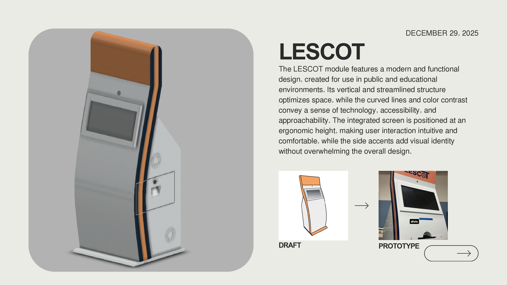
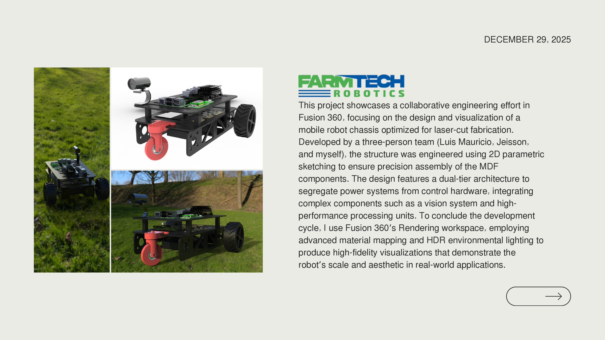
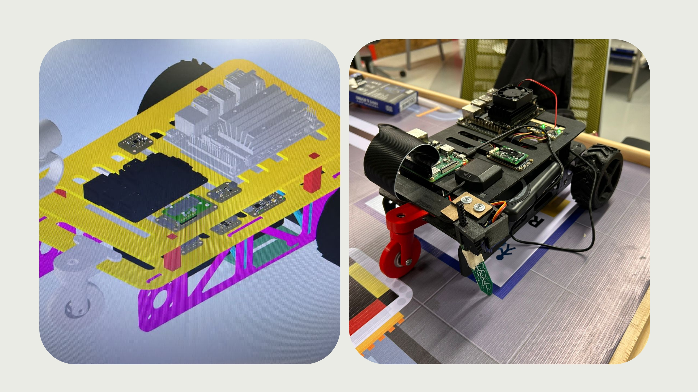
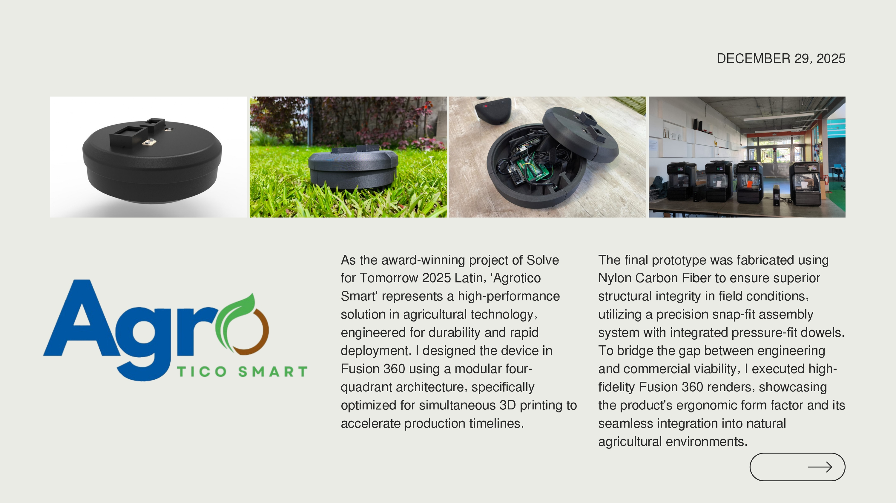
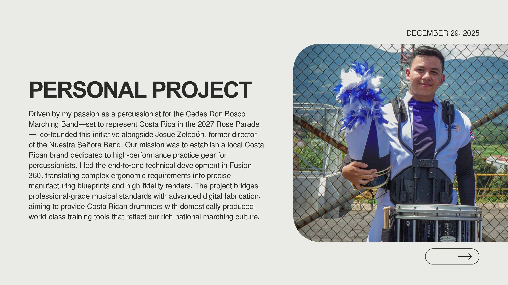
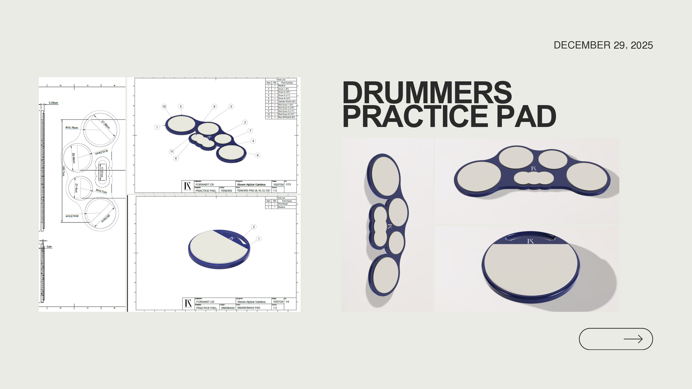
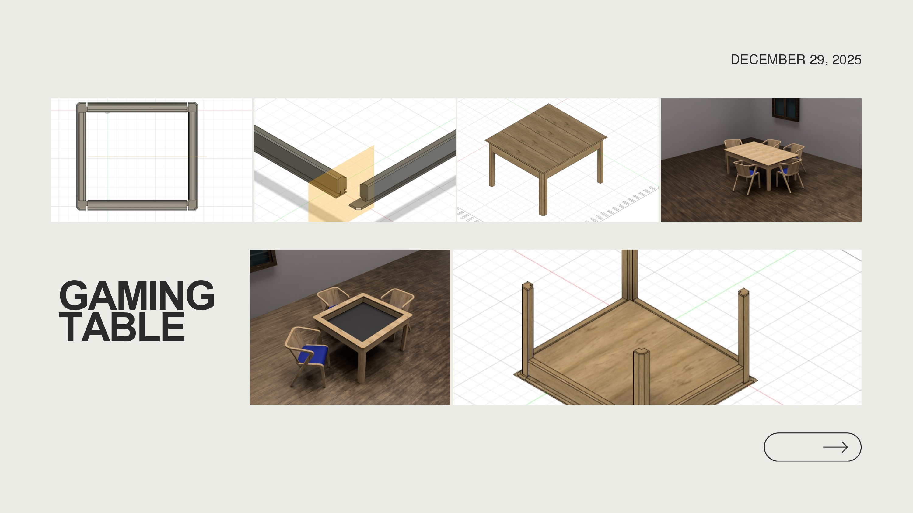
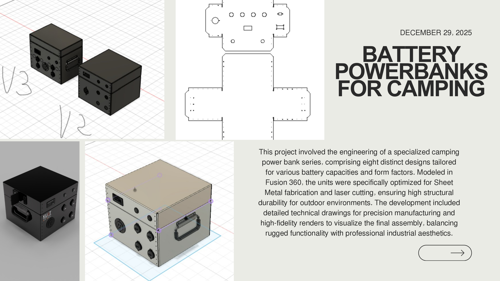

# 🧩 Fusion 360 Engineering & Design Portfolio

This portfolio showcases a selection of **engineering and product design projects developed in Autodesk Fusion 360**, focused on **real-world manufacturability, structural integrity, and professional-grade visualization**.

The work spans **assistive technology, agricultural devices, robotics, musical equipment, and outdoor products**, combining **mechanical engineering principles with digital fabrication workflows**.

---

## 🧠 Design Philosophy

My design approach prioritizes:

- Manufacturability-first engineering  
- Modular and parametric design  
- Structural durability for real-world use  
- Clear separation of functional systems  
- High-fidelity visualization for technical and commercial communication  

Fusion 360 was used not only as a CAD tool, but as a **complete product development environment**, from concept to final render.

---

## 🤟 LESCOT Module (2023–2024)

The **LESCOT module** was designed as a **public-facing assistive technology device** for Costa Rican Sign Language (LESCO) translation.

### Design Highlights
- Vertical, space-efficient structure  
- Ergonomic screen placement for intuitive interaction  
- Smooth curves and contrasting colors to convey accessibility and technology  
- Designed for educational and public environments  

### Tools & Methods
- Fusion 360 parametric modeling  
- Ergonomic layout optimization  
- High-quality rendering for presentation and exhibitions  

---

## 🤖 Agricultural Robot Chassis – Collaborative Project

This project involved the **design and visualization of a mobile robot chassis**, optimized for **laser-cut fabrication**.

### Engineering Focus
- 2D parametric sketching for precise MDF assembly  
- Dual-tier architecture separating power and control systems  
- Integration planning for vision systems and high-performance processors  

### Collaboration
Developed as part of a **three-person engineering team**, focusing on mechanical precision and assembly efficiency.

### Visualization
- Fusion 360 Rendering workspace  
- Advanced material mapping  
- HDR environmental lighting for realistic scale and context  

---

## 🌱 AgroTico Smart Device (Solve for Tomorrow 2025 – LATAM Winner)

As part of the **award-winning AgroTico Smart project**, I designed a **field-deployable agricultural device** engineered for durability and rapid production.

### Key Design Features
- Modular four-quadrant architecture  
- Optimized for simultaneous 3D printing  
- Snap-fit assembly system with pressure-fit dowels  
- Designed for outdoor agricultural environments  

### Materials & Fabrication
- Nylon Carbon Fiber for structural strength  
- Modular design to reduce production time  
- High-fidelity renders bridging engineering and commercialization  

🏆 **Samsung Solve for Tomorrow 2025 – Latin America Winner**

---

## 🥁 Snare / Tenors Practice Pad (Personal Project)

Driven by my experience as a **percussionist in the CEDES Don Bosco Marching Band**, I co-founded a project to develop **professional-grade percussion practice equipment**.

### Design Objectives
- Ergonomic optimization for long practice sessions  
- Professional musical standards  
- Local manufacturing feasibility  

### Role
- End-to-end mechanical design in Fusion 360  
- Manufacturing-ready blueprints  
- Product visualization for branding and presentation  

This project aims to establish a **Costa Rican brand of high-performance percussion gear**.

---

## 🎮 Gaming Table (Personal Project)

A custom-designed **gaming table**, focused on:

- Structural stability  
- Cable management  
- Ergonomic layout  
- Clean industrial aesthetics  

Designed entirely in Fusion 360 with emphasis on **user comfort and modular assembly**.

---

## 🔋 Camping Battery Power Banks (Laser Cutting Project)

This project involved the engineering of **eight distinct camping power bank enclosures**, each tailored for different battery capacities.

### Engineering Focus
- Sheet metal design workflows  
- Laser cutting optimization  
- Rugged outdoor durability  
- Precise technical drawings for fabrication  

### Output
- Manufacturing-ready files  
- Professional-grade renders  
- Modular enclosure system  

---

## 🛠 Skills Demonstrated

### Technical Skills
- Advanced Fusion 360 modeling  
- Parametric and modular design  
- Sheet metal and laser-cut fabrication  
- 3D printing optimization  
- Assembly and tolerance planning  
- High-fidelity rendering and visualization  

### Professional Skills
- Design for manufacturability  
- Cross-disciplinary collaboration  
- Product presentation and documentation  
- Engineering-to-market communication  

---

## 🚀 Closing Statement

This portfolio reflects my ability to **translate ideas into functional, manufacturable, and visually compelling products**, using Fusion 360 as a core engineering tool across diverse industries.

---

*Designed, engineered, and rendered by Steven Alpízar Gamboa.*
